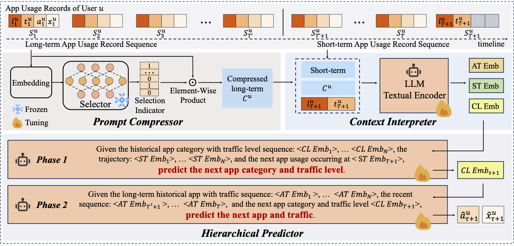

# LLMApp: Unleash the Power of Large Language Model for Mobile App Usage Prediction

## Abstract
Mobile applications serve as gateways to many essential services in human daily life. However, delays, unstable resource usage, or inefficient traffic handling greatly affect the overall service experience. An effective strategy to address these issues is to predict the app usage and load the subsequent app into memory in advance. Mobile app usage prediction can help reduce service delay, support better resource allocation, and assist network operators in managing traffic changes, ultimately improving the quality and responsiveness of mobile services.
In this paper, we introduce LLMApp, a hierarchical prediction framework that leverages large language models to predict mobile app usage. First, LLMApp employs a prompt compressor to filter redundant long-term usage logs to obtain concise summary prompts that the LLM can effectively reason over. Second, a context interpreter encodes diverse contextual information into unified representations and projects them into the LLM’s semantic space, enabling joint interpretation of spatiotemporal and behavioral signals. Finally, a hierarchical predictor leverages the semantic reasoning capabilities of LLMs to perform coarse-to-fine mobile app usage prediction.
Experiments on two real-world datasets show that LLMApp outperforms baseline approaches under the metrics of Top-k Accuracy (ACC@K), Mean Reciprocal Rank (MRR@K), and Normalized Discounted Cumulative Gain (NDCG@K). Further analysis demonstrates that LLMApp exhibits strong robustness and scalability, achieves effective redundancy filtering, and accurately captures spatiotemporal patterns underlying user app usage behavior.

## Framework Overview



## Dataset
The model uses two real-world mobile app usage datasets (including fields such as location, time, app, traffic, etc.)：

- Shanghai Mobile App Usage Dataset（2016）  
- Nanchang Mobile App Usage Dataset（2022）  

Data source：  
https://fi.ee.tsinghua.edu.cn/appusage/

## Run
```bash
chmod +x scripts/run_shanghai.sh
bash scripts/run_shanghai.sh
```

## Citation
```
@article{LLMApp2025,
  title={LLMApp: Unleashing the Power of Large Language Model for Mobile App Usage Prediction},
  author={Bo Liu and Tong Li and Miao Xiao and Beihao Xia and Zhu Xiao and Zhuo Tang and Kenli Li},
  year={2025}
}
```
