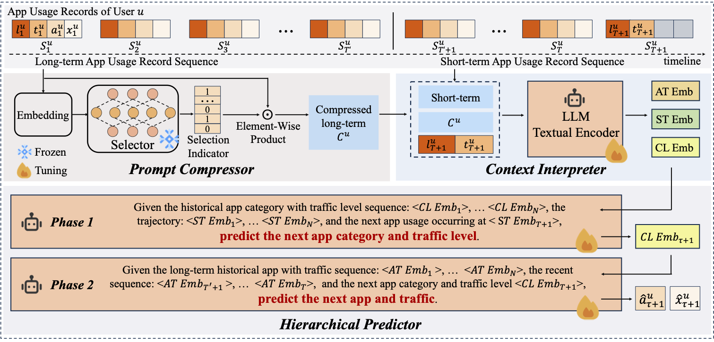
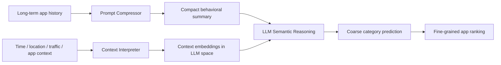

<div align="center">

# LLMApp
### Unleashing the Power of Large Language Model for Mobile App Usage Prediction

[](https://ieeexplore.ieee.org/)
[](https://tong89.github.io/tongli.github.io/)

**Bo Liu · Tong Li · Miao Xiao · Beihao Xia · Zhu Xiao · Zhuo Tang · Kenli Li**

*IEEE Transactions on Services Computing, 2026 — Accepted*

</div>

---

## Overview

**LLMApp** is a hierarchical mobile app usage prediction framework that uses large language models as semantic reasoning engines. Instead of treating app histories as flat sequential signals, LLMApp first compresses long-term behavioral logs, then interprets heterogeneous context, and finally performs coarse-to-fine reasoning over future app choices.

<p align="center">
  
</p>

<p align="center"><em>Overall framework of LLMApp.</em></p>

## Abstract

Mobile applications serve as gateways to many essential services in everyday life. However, service delays, unstable resource usage, and inefficient traffic handling can substantially affect the overall user experience. Predicting which application a user is likely to access next enables systems to preload applications into memory, reduce service latency, improve resource allocation, and help network operators better respond to traffic variations. In this work, we introduce **LLMApp**, a hierarchical prediction framework that leverages large language models for mobile app usage prediction. First, LLMApp employs a **Prompt Compressor** to remove redundant information from long-term app usage histories and convert them into concise behavior summaries that an LLM can effectively reason over. Second, a **Context Interpreter** encodes heterogeneous contextual signals into unified representations and projects them into the semantic space of the LLM, enabling joint reasoning over spatiotemporal and behavioral information. Finally, a **Hierarchical Predictor** exploits the semantic reasoning capability of LLMs to perform coarse-to-fine prediction of future mobile app usage. Experiments on two real-world datasets show that LLMApp consistently outperforms competitive baselines under **Top-k Accuracy (ACC@K)**, **Mean Reciprocal Rank (MRR@K)**, and **Normalized Discounted Cumulative Gain (NDCG@K)**. Additional analyses demonstrate strong robustness and scalability, effective redundancy filtering, and the ability to capture spatiotemporal patterns underlying user app usage behavior.

## Problem Setting

Given a user's historical app usage sequence together with contextual information such as time, location, traffic, and app metadata, the goal is to rank the apps that are most likely to be used next. This problem is difficult because long-term logs are highly redundant, contexts come from heterogeneous feature spaces, and the final prediction space may contain a large number of candidate apps.


```mermaid
flowchart LR
    A[Long-term app history] --> B[Prompt Compressor]
    B --> C[Compact behavioral summary]
    D[Time / location / traffic / app context] --> E[Context Interpreter]
    E --> F[Context embeddings in LLM space]
    C --> G[LLM Semantic Reasoning]
    F --> G
    G --> H[Coarse category prediction]
    H --> I[Fine-grained app ranking]
```

## Method

### 1. Prompt Compressor

The Prompt Compressor removes repetitive or weakly informative portions of long-term usage histories while preserving behavior patterns useful for downstream prediction. This allows the LLM to reason over a concise summary instead of an excessively long raw sequence.

### 2. Context Interpreter

The Context Interpreter transforms heterogeneous contextual signals into unified representations and aligns them with the LLM semantic space. This makes temporal, spatial, traffic, and behavioral information available to the same reasoning process.

### 3. Hierarchical Predictor

Rather than directly selecting one app from the entire candidate space, LLMApp performs coarse-to-fine reasoning. A higher-level prediction narrows the candidate range, after which fine-grained ranking identifies the most likely next apps.

## Code-to-Paper Map

| Paper component | Main implementation | Role |
| --- | --- | --- |
| Main predictor | `model/Predictor.py` | Hierarchical LLM-based app prediction |
| Ablation variants | `model/Predictor_ablation.py` | Controlled component removal |
| Candidate / selector module | `model/Selector.py` | Candidate selection and coarse prediction |
| Data pipeline | `dataset/MyDataset.py` | App-usage sample construction |
| Predictor training | `trainer/PredictorTrainer.py` | Training / evaluation loop |
| Selector training | `trainer/SelectorTrainer.py` | Selector optimization |
| Experiment configuration | `config.py` | Model, data, and training parameters |
| Shanghai experiments | `scripts/run_shanghai.sh` | Main Shanghai pipeline |
| Nanchang experiments | `scripts/run_nanchang.sh` | Main Nanchang pipeline |

## Dataset

The repository contains sample data under `data/sample/` to illustrate the expected format.

| File | Description |
| --- | --- |
| `app.csv` | App metadata |
| `category.csv` | App category information |
| `location.csv` | Location-related context |
| `traffic_bins.csv` | Traffic/context discretization |
| `app_usage_records/data_sample.csv` | Example app usage records |

The paper evaluates on two real-world datasets:

- **Shanghai Mobile App Usage Dataset** (2016)
- **Nanchang Mobile App Usage Dataset** (2022)

Original data source: https://fi.ee.tsinghua.edu.cn/appusage/

Please follow the original data provider's privacy and usage requirements.

## Evaluation

LLMApp uses ranking-oriented metrics that reflect both whether the correct app appears in the recommendation list and how highly it is ranked:

- **ACC@K** — whether the ground-truth app appears among the top-K predictions.
- **MRR@K** — reciprocal-rank-based measure emphasizing earlier correct predictions.
- **NDCG@K** — rank-sensitive metric that rewards correct items placed near the top of the list.

The repository also contains ablation scripts for studying the contribution of individual modules.

## Running the Code

### Shanghai

```bash
chmod +x scripts/run_shanghai.sh
bash scripts/run_shanghai.sh
```

### Nanchang

```bash
chmod +x scripts/run_nanchang.sh
bash scripts/run_nanchang.sh
```

### Ablation

```bash
bash scripts/run_nanchang_ablation.sh
```

The top-level `run.py` and `config.py` provide the main experiment entry and configuration. Dataset/checkpoint paths may need to be adjusted for your local environment.

## Repository Structure

```text
LLMApp/
├── data/
│   └── sample/                   # Example data and metadata
├── dataset/
│   └── MyDataset.py              # Dataset construction
├── model/
│   ├── Predictor.py              # Main hierarchical predictor
│   ├── Predictor_ablation.py     # Ablation variants
│   └── Selector.py               # Candidate/category selector
├── trainer/
│   ├── PredictorTrainer.py
│   └── SelectorTrainer.py
├── scripts/                      # Shanghai/Nanchang experiment scripts
├── config.py                     # Configuration
├── run.py                        # Main entry point
├── framework.png                 # Paper framework
├── framework.pdf                 # Vector framework figure
└── README.md
```

## Paper & Download

The paper was accepted by **IEEE Transactions on Services Computing (TSC)** on **September 6, 2026**.

- **Publisher:** IEEE Transactions on Services Computing
- **Status:** Accepted; publisher production/indexing is in progress.
- **IEEE Xplore:** https://ieeexplore.ieee.org/
- **Framework PDF:** [`framework.pdf`](framework.pdf)

> The final article page / publisher PDF link will be added once IEEE production and indexing are complete.

## Citation

```bibtex
@article{liu2026llmapp,
  title   = {LLMApp: Unleashing the Power of Large Language Model for Mobile App Usage Prediction},
  author  = {Liu, Bo and Li, Tong and Xiao, Miao and Xia, Beihao and Xiao, Zhu and Tang, Zhuo and Li, Kenli},
  journal = {IEEE Transactions on Services Computing},
  year    = {2026},
  note    = {Accepted}
}
```

## About the Author

This repository is maintained by **Bo Liu**, a Master’s student at the **College of Computer Science and Electronic Engineering, Hunan University** and the **National Supercomputing Center in Changsha**. His broader research focuses on **Agentic AI, LLMs, Spatiotemporal Intelligence, and Mobile Data Mining**.

For questions, reproduction issues, or academic collaboration, please open an issue or contact `liubo317@hnu.edu.cn`.  
Personal homepage: https://boliupro.github.io
